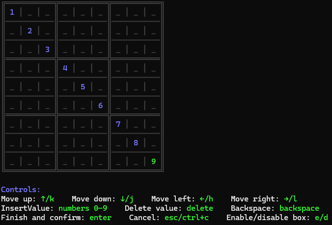

# Kangaroo

A simple CLI that will help you to solve a Sudoku puzzle. It implements Crook's method - [a preemptive sets](https://www.sudokuwiki.org/Crooks_Algorithm) alrogithm to solve the sudoku.

### Quick usage

Use `kangaroo create -o <path to file>` command to use terminal's editor to configure the sudoku and save sudoku configuration to a json file.

If you have sudoku file, you can use `kangaroo solve -i <path to file>` to solve sudoku from the file.

Or just use `kangaroo solve` to provide sudoku configuration through the terminal and solve it.



You can also use the CLI to solve sudokus provided in base64 format and receive solution also encoded in base64 - in case you wolud like to call the cli from different application: `kangaroo exec AAEDAwP/gAYAAAABAAAABwAAAwIABQAAAAQAAAAHAAAAAQAAAAkAAAAEAAEIAAAAAAYABwUAAAAIAAAAAAAABgAIAAIAAAAAAAADAAUGAAAAAwACAAcAAA==` You can read more about the data format in [the binary format documentation](./documentation/binaryFormat.md).

### Commands

**There are just 3 commands in the CLI:**

**create**

```
NAME:
   Kangaroo create - Creates sudoku puzzle data and saves to provided file paths
                     (JSON and TXT files supported, default is JSON). At least one file
                     path for output must be provided. You can ommit prompts for box size
                     and sudoku layout by using flags -b, --lw, --lh.

USAGE:
   Kangaroo create [command options] [arguments...]

OPTIONS:
   --box-size value, -s value         How many rows and columns single sudoku box has - in case of classic sudoku it is 3 (default: 0)
   --layout-width value, --lw value   How many boxes there are in the row - in case of classic sudoku it is 3 (default: 0)
   --layout-height value, --lh value  How many boxes there are in the column - in case of classic sudoku it is 3 (default: 0)
   --overwrite, -r                    Overwrite provided file(s) paths if exist (default: false)
   --help, -h                         show help 
```

**solve**

```
NAME:
   Kangaroo solve - Solves a provided sudoku puzzle. There are few formats supported
                    for this command. You can pass an input data json file path using -i flag.
                    This option will have precedence over all other because the file contains all
                    the data required to build sudoku object. In case no -i flag is passed, then
                    cli works in manual mode - it will ask for box size, and sudoku layout and all
                    sudoku values. Box size, and sudoku layout prompts may be ommited by using -s,
                    --lw and --lh flags. You can save result of sulution to a file with a -o flag.

USAGE:
   Kangaroo solve [command options] [arguments...]

OPTIONS:
   --box-size value, -s value         How many rows and columns single sudoku box has - in case of classic sudoku it is 3 (default: 0)
   --layout-width value, --lw value   How many boxes there are in the row - in case of classic sudoku it is 3 (default: 0)
   --layout-height value, --lh value  How many boxes there are in the column - in case of classic sudoku it is 3 (default: 0)
   --overwrite, -r                    Overwrite provided file(s) paths if exist (default: false)
   --input-file value, -i value       Specify path to sudoku JSON configuration file
   --output-file value, -o value      Specify path to file where you want to save solution of the sudoku (JSON or TXT, JSON is default)
   --help, -h                         show help
```

**exec**

```
NAME:
   Kangaroo exec - Solves a sudoku puzzle provided through argument as base64 representation
                   of sudoku binary data and outputs similarly encoded solution to the terminal.
                   You can find more about this format here:
                   https://github.com/Michu8258/kangaroo/blob/main/documentation/binaryFormat.md

USAGE:
   Kangaroo exec [command options] [arguments...]

OPTIONS:
   --help, -h  show help
```

### Documentation

Fore more information, please navigate to [./documentation](./documentation/nomenclature.md) directory of this repository.

### Stack

- Go
- [bubbletea](https://github.com/charmbracelet/bubbletea)
- [gouuid](https://github.com/nu7hatch/gouuid)
- [urfave cli](https://github.com/urfave/cli)